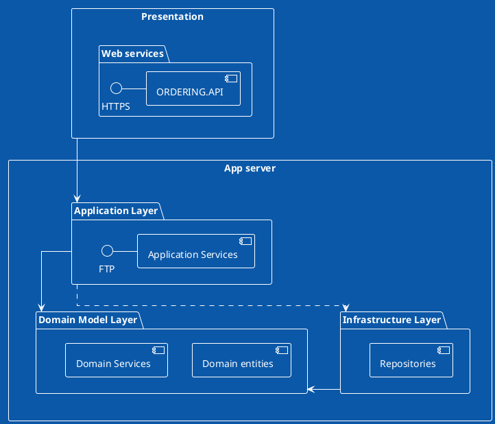

# Basket.API

## Ordering Use cases
### CRUD Operations
* Get Order with Item (can filter by Name and Customer)
* CRUD operations including
  * Create a new order
  * Update an exisiting order
  * Delete order
  * Add and remove Item from Order
### Async Ordering operations
* Basket checkout: Consume Basket event from RabbitMQ
* Orde Fulfilment: Perform order fulfilment operation (billing, shipment, notification)
* Raise ORDER_CREATED domain event that leads to integration event.

### Available REST API operations

| Operation | Use Cases | Request URI |
| --------- | --------- | ------------- |
| GET | Get Orders /w Pagination | /orders |
| GET | Get Orders by OrderName | /orders/{orderName} |
| GET | Get Orders by Customer | /orders/customer/{customerId} |
| POST | [NewOrder](#Create a new Order)  | /orders |
| PUT | [UpdateOrder](#Update existing  Order)  | /orders |
| DELETE | Delete order  | /order/{id} |

### <a id="NewOrder"></a> Request message
```json
{
  "Todo" : "Todo"
}
```

### <a id="UpdateOrder"></a> Request message
```json
{
  "Todo" : "Todo"
  
}
```

# diagram

